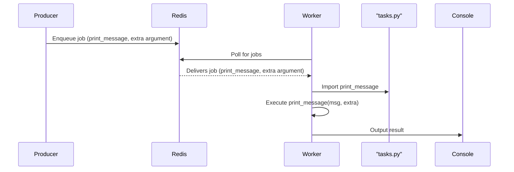

# Step 2: Enqueue the Task from the Producer

## Short Explanation

- The **producer** connects to Redis and enqueues a job by calling `q.enqueue(print_message, 'Hello from the queue!', 'This is an extra argument!')`.
- This job (function name + arguments) is sent to Redis and stored in the queue.
- The job is now waiting in Redis for a worker to pick it up and execute it.

## Visual Diagram

---

**Summary:**
The producer puts a job (with multiple arguments) into the Redis queue. The worker will later fetch and execute this job using the function defined in `tasks.py`.
