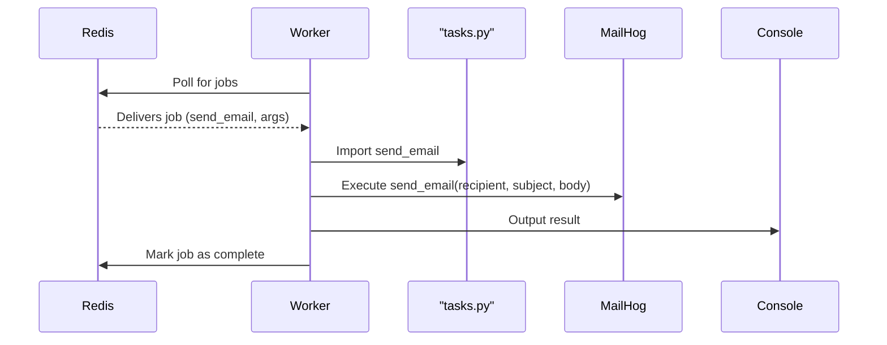

# Step 3: Worker Fetches and Executes the Job (Email Notification)

## Short Explanation
- The **worker** continuously listens to the Redis queue for new jobs.
- When a job is available, the worker fetches it from Redis.
- The worker imports the function (e.g., `send_email`) from `tasks.py` and executes it with the arguments provided by the producer.
- For email jobs, the worker sends an email (captured by MailHog and viewable at http://localhost:8025).
- The result (e.g., a printed message or sent email) is output by the worker, and the job is marked as complete.

## Visual Diagram

---

**Summary:**
- The worker acts as a consumer, processing jobs as soon as they are available in the queue.
- For email jobs, the worker sends the email using the SMTP server (MailHog), and you can view the result in the MailHog web UI.
