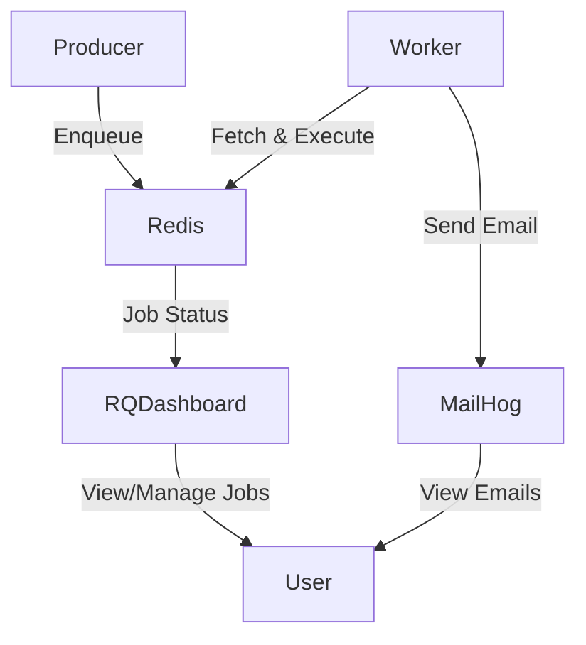

# Step 4: Monitoring and Managing Jobs

## Short Explanation
- After jobs are enqueued and processed, you need to monitor the queue, inspect job statuses, and manage failed or stuck jobs.
- RQ Dashboard provides a web UI for real-time monitoring and management of your job queues.
- MailHog provides a web UI to inspect the content of sent emails.

## How to Use RQ Dashboard
1. RQ Dashboard is included in your `docker-compose.yml` as the `rq-dashboard` service.
2. Start your stack with:
   ```bash
   docker-compose up --build
   ```
3. Open [http://localhost:9181](http://localhost:9181) in your browser to view the dashboard.
4. You can:
   - View queued, running, completed, and failed jobs
   - Requeue or delete failed jobs
   - Monitor queue length and worker status

## How to Use MailHog
- Open [http://localhost:8025](http://localhost:8025) to view all emails sent by your app.

## Visual Diagram



---

**Summary:**
- RQ Dashboard gives you visibility and control over your background jobs.
- MailHog lets you inspect the content of sent emails.
- Together, they provide a complete feedback loop for development and debugging.
