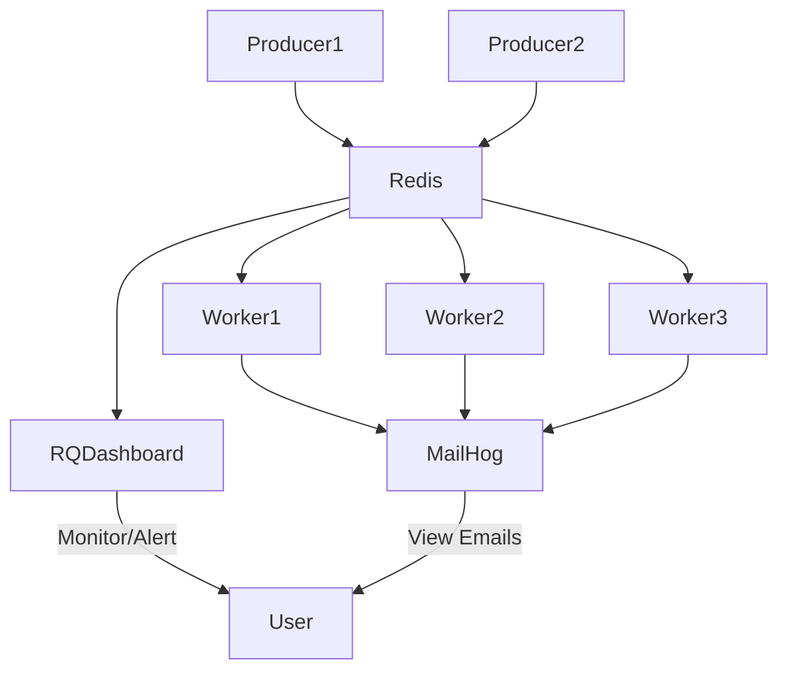

# Step 5: Scaling, Reliability, and Production Considerations

## Short Explanation
As your system grows, you need to ensure it can handle more jobs, recover from failures, and operate securely in production. This step covers scaling, reliability, monitoring, and security.

## Key Topics

### 1. Scaling Workers and Producers
- Use `docker-compose up --scale worker=N` to run multiple workers in parallel.
- Scale producers if you have multiple sources of jobs.
- For large scale, consider Kubernetes or other orchestration tools.

### 2. Job Reliability and Persistence
- **Redis Persistence:** Enable Redis persistence (AOF or RDB) to avoid job loss if Redis restarts.
- **Idempotent Tasks:** Make sure your tasks can safely run more than once (at-least-once delivery).
- **Retries:** Use RQ’s retry mechanism for failed jobs.

### 3. Monitoring and Alerting
- Use RQ Dashboard for real-time monitoring.
- Set up alerting for failed jobs, long queues, or worker crashes.
- Use logs and metrics (e.g., Prometheus, Grafana) for deeper insights.

### 4. Security
- Never expose Redis or MailHog to the public internet.
- Use strong passwords and firewalls.
- Store secrets (SMTP credentials, etc.) securely (e.g., Docker secrets, environment variables).

### 5. Deployment Best Practices
- Use Docker volumes to persist generated files (e.g., PDFs) outside the container.
- Use health checks for your services.
- Automate deployment with CI/CD pipelines.

## Visual Diagram

## Summary Table

| Topic         | Best Practice / Recommendation                |
|---------------|----------------------------------------------|
| Scaling       | Use `--scale` or orchestration tools         |
| Reliability   | Enable Redis persistence, use retries        |
| Monitoring    | Use RQ Dashboard, set up alerting            |
| Security      | Never expose Redis/MailHog, use secrets      |
| Deployment    | Use volumes, health checks, CI/CD            |

---

**This step ensures your task queue system is robust, scalable, and production-ready.**
